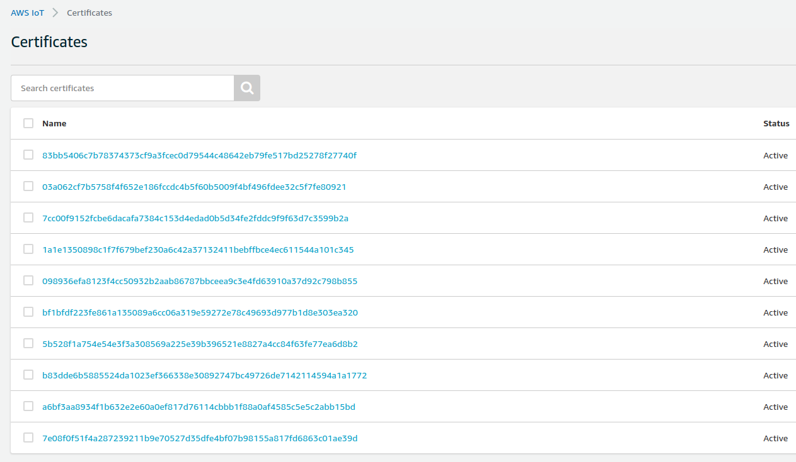
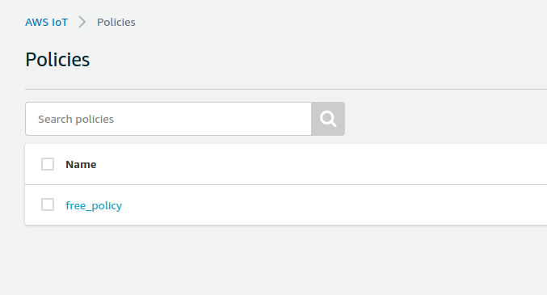

# User Guide

## Installation

The complete project can be found in this repository created by Yilmaz Naci Aslan. For installation please navigate to the github [repository](https://github.com/yilmaznaslan/aws-iot-core-create-many-things-boto3) or simply [download](https://github.com/yilmaznaslan/aws-iot-core-create-many-things-boto3/archive/refs/heads/master.zip) as zip.


Once the repository is downloaded follow the guidelines below for depending on your operating system

### Ubuntu 

```
cd YOUR_WORKING_DIRECTORY
source installation.sh
```


### Windows
``
Not tested yet
``

## Configuration

Once the installation is completed, some configurations are needed be done. All the configuration parameters are defined in the ``scrpts/config.py`` script. Configuration steps can be grouped into following sections

- AWS IAM Role
- Application Configuration

### AWS IAM Configuration

The very first thing to configure is the **user settings** for accesing to AWS IoT Core using boto3. If you don't have AWS account please create one before proceeding the next steps.

#### Create an IAM user

It is good practice to create an AWS user for your account rather than using the root account. 

- Create a user for your AWS account by enabling both **Programmatic access** and **Console Acces**. 
- Save/download the credetion ID and and scret key
- Add the following policies to the user
    - AWSIoTFullAccess
    - AWSS3FullAccess

Save the AWS Access Key Id and Access Key into corrosponding ``.config`` file in the operating system.
```
aws_access_key_id = xxxxxxxx
aws_secret_access_key = xxxxxxxx
```
> For more information about please see the more detailed explanation section. 
### Application Configuration (Optional)
#### Set Region
Under the application configuration, ``REGION`` of the AWS IoT Core Service being used is defined. Default value for te region is ``REGION = "us-east-1"``. If you want to run your applicatio in another region then simply change the Region constant in ``config.py`` to another location.

```
REGION = "us-east-1"
```
#### Set Certification option
When creating multiple things for to beu the recommand e each thing has a unique certification. This is important for cyber security aspect. However for experimenting purposes one can also use the same certification for multiple things. This behahoiver is determined with the ``set_unique`` flag in ``config.py``. By keeping this flag true, a unique certificate will be generated for each thing. Defining this flag to False will generate only one certification in aws iot core, and this certificate will be used for authenticating the created things.

Default value of the flag is defined as True.
```
set_unique = True
```
#### Set a name for the thing type

## Run

Once the installation and AWS IAM Configuration is completed, you can execute the ``main.py`` script. By using the default parameters in ``Application Configuration``, the program will executes as below;

1. Creates a `S3 Bucket` to be used to store provisioning data file.
2. Creates `10 things, 10 certificates and a policy` to test the mqtt connection. 
3. Stores the created certificates and keys under `secure/keys and secure/certificate` directories of the project folder. 
4. Attaches created each certificate with a thing and a policy.

### Results

Once the execution of the `main.py` finishes, following resources can be found on the AWS IoT Core Service of the selected Region.
#### Things


#### Thing types


#### Certificates



#### Policy

